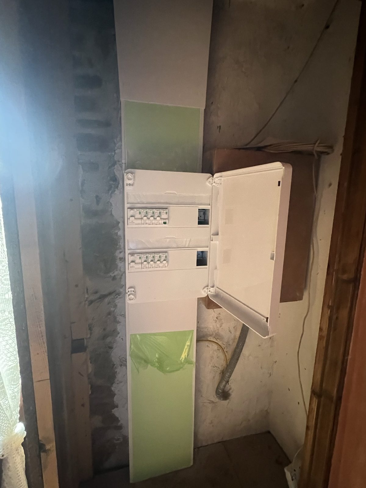
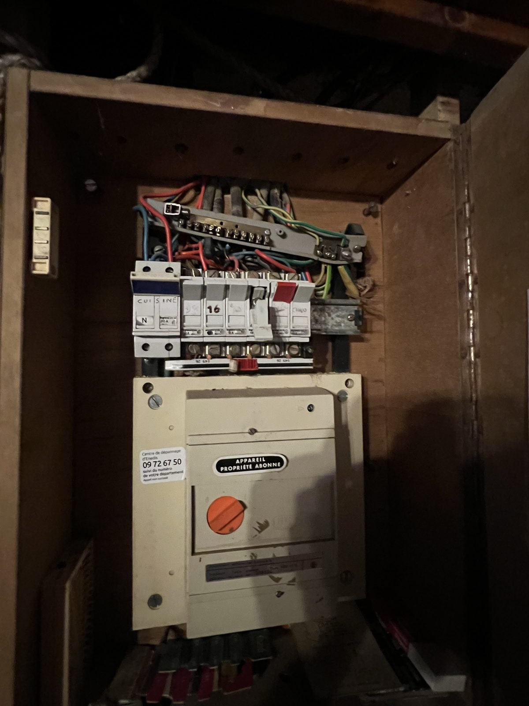
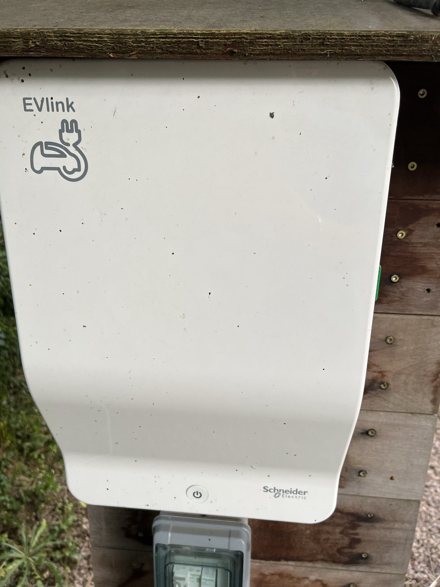
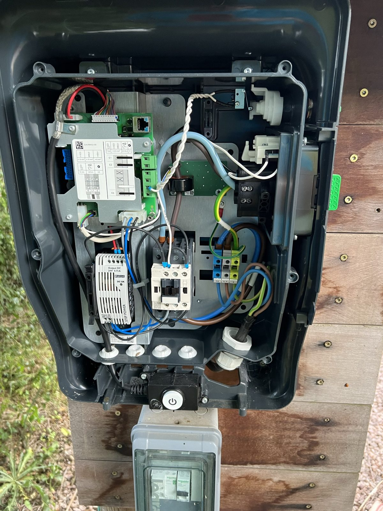
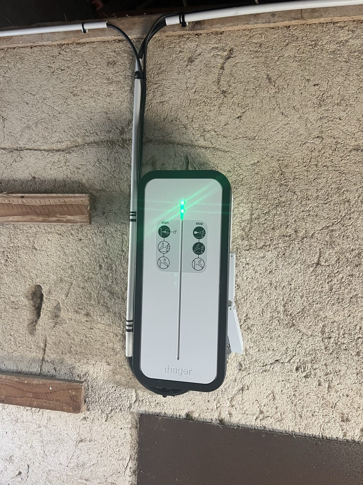
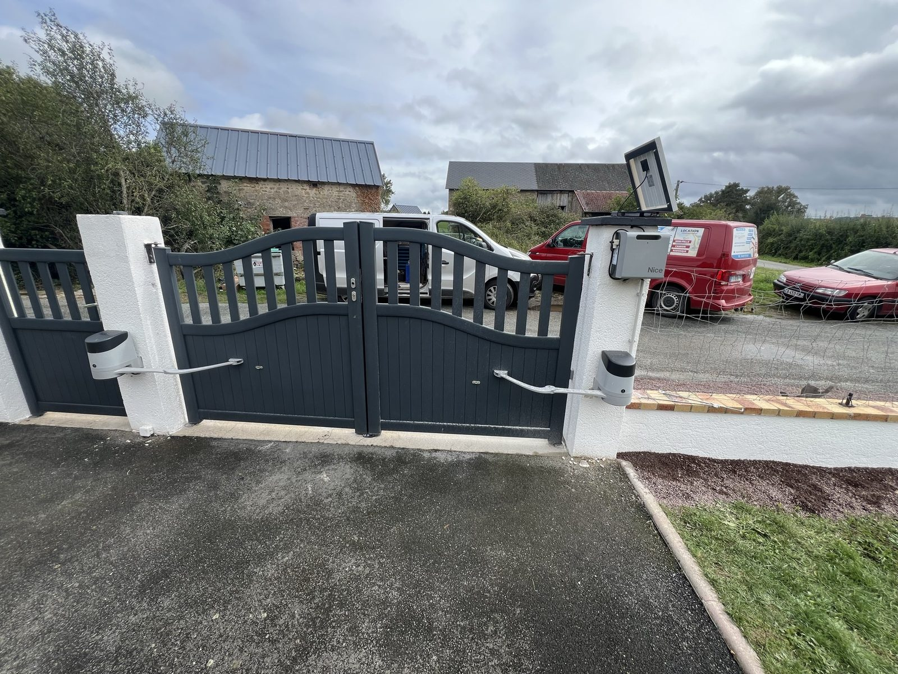
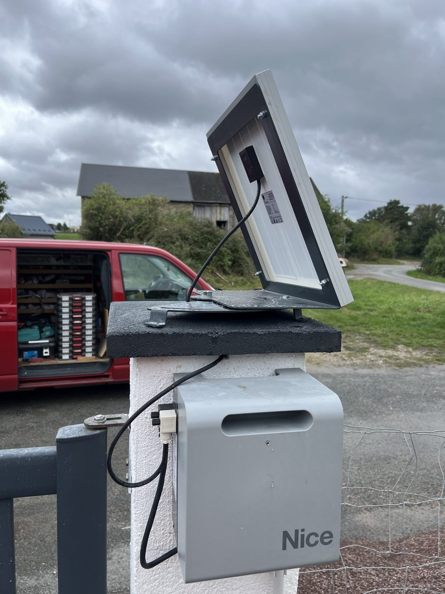
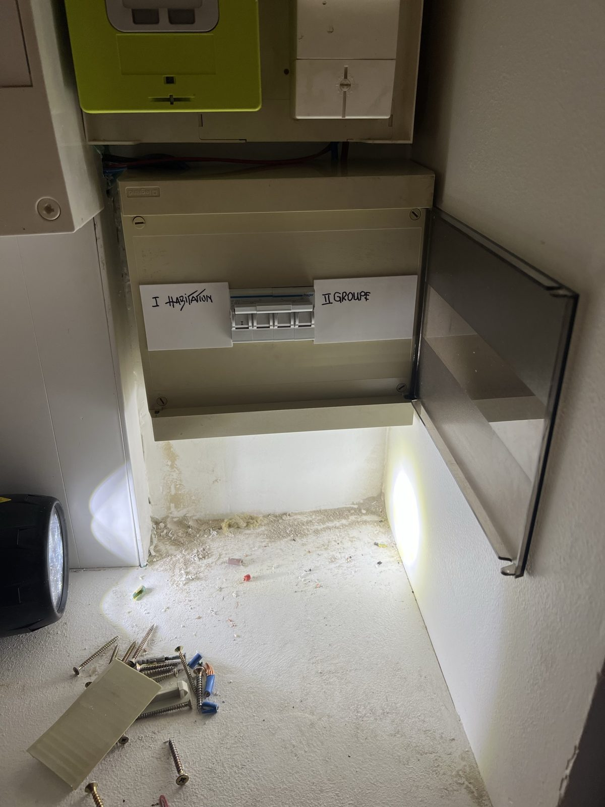
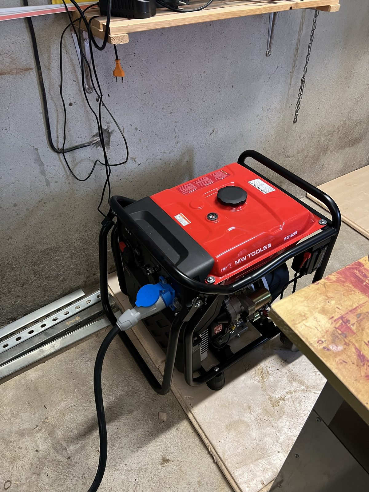
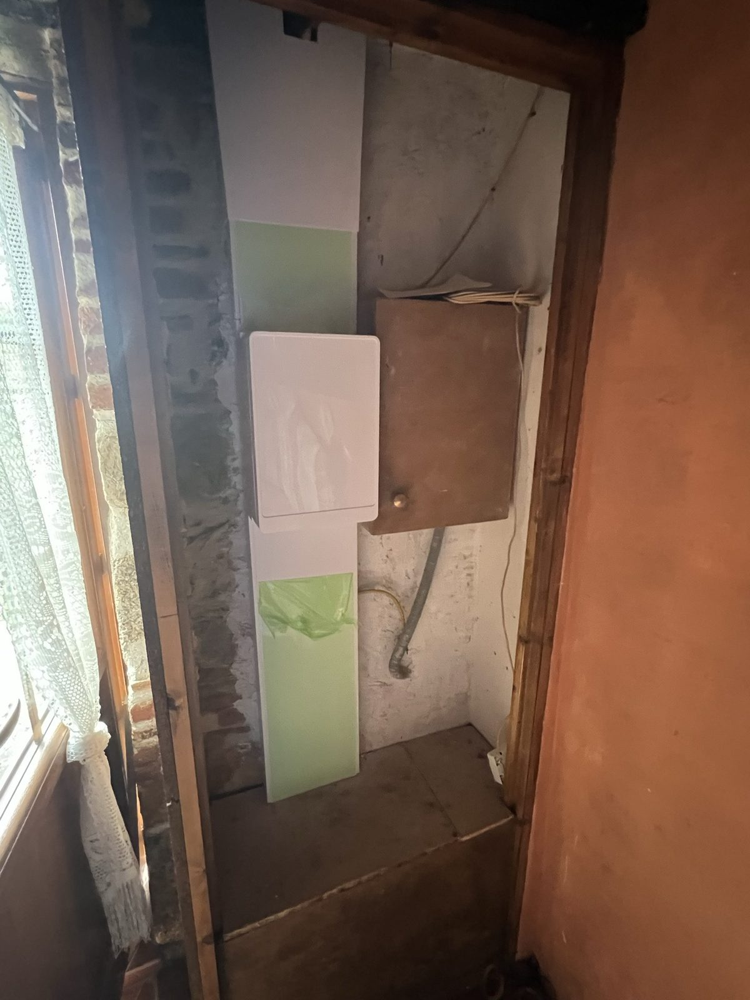

Artisan électricien · Marcillat-en-Combraille (03)

# Laurent Agnese L'électricité *sûre, nette, locale.*

Sept ans d'expertise au cœur de la Combraille. De la rénovation complète
à la borne de recharge, du dépannage dominical au groupe électrogène agricole —
un artisan, un interlocuteur, une parole tenue.

[Demander un devis gratuit](#devis)
[06 49 79 70 33](tel:+33649797033)

29années en Combraille

4,5⭐ sur Google

7services spécialisés

24hpour votre devis

Découvrir

Dépannage 7j/7 · Week-ends & jours fériés

## Une panne ? *On ne laisse personne sans courant.*

Disjoncteur qui saute sans arrêt, coupure totale un dimanche, prise qui chauffe,
tableau défaillant. Laurent intervient en priorité sur Marcillat et 50 km alentour —
diagnostic méthodique, tarif annoncé avant travaux, garantie sur la réparation.

[Appeler maintenant
**06 49 79 70 33**](tel:+33649797033)
[WhatsApp
**Envoyer un message**](https://wa.me/33649797033?text=Bonjour%20Laurent%2C%20j%27ai%20une%20panne%20%C3%A9lectrique%20%C3%A0%20)

Réponse sous **15 min**

Tarif **avant** intervention

Réparation **garantie**

### Les 5 urgences les plus fréquentes

Laurent les diagnostique et les répare en moyenne sous 1 h d'intervention.

- **Coupure générale**
  Plus rien ne fonctionne dans la maison. On localise la panne en priorité.

  →
- **Disjoncteur qui saute**
  Circuit surchargé, fuite à la terre, différentiel fatigué — diagnostic précis.

  →
- **Prise ou fil qui chauffe**
  Risque incendie — intervention la plus prioritaire, ne surtout pas attendre.

  →
- **Tableau défaillant**
  Voyant rouge, bruit suspect, différentiel HS, bornes chaudes. Remise en sécurité.

  →
- **Panne éclairage / prises**
  Un circuit entier ou une pièce sans courant. On remonte la chaîne jusqu'à l'origine.

  →

**Votre cas n'est pas listé ?** Laurent diagnostique tout type de panne électrique domestique ou tertiaire — appelez, on en parle.

Assurance décennale

Devis sous 24h

Dépannage 7j/7

Artisan local · Combraille

Devis gratuit · 24 h

NF C 15-100 respectée

Consuel obtenu

4,5 ★ · 9 avis Google

Assurance décennale

Devis sous 24h

Dépannage 7j/7

Artisan local · Combraille

Devis gratuit · 24 h

NF C 15-100 respectée

Consuel obtenu

4,5 ★ · 9 avis Google

Nos spécialités

## Sept savoir-faire, *un seul artisan.*

Chaque chantier est pensé, chiffré et exécuté par Laurent lui-même. Pas de sous-traitance surprise, pas de devis flou — l'électricité comme elle devrait toujours être faite.

01

### Rénovation électrique

Refonte complète du câblage, nouveau tableau, prises et éclairage adaptés. Maison ancienne, grange, appartement.

- Étude pièce par pièce
- Gainage moderne
- Consuel à la livraison

02

### Dépannage 7j/7

Coupure, disjoncteur, court-circuit, prise qui chauffe : diagnostic rapide, réparation propre, tarif annoncé.

- Prioritaire 50 km
- Tarif avant travaux
- Réparation garantie

03

### Remise aux normes

Mise en conformité NF C 15-100, terre, différentiels 30 mA, tableau sécurisé. Vente, location, sécurisation.

- Diagnostic gratuit
- Conformité Consuel
- Valorise le bien

01

### Rénovation électrique

Refonte complète du câblage, nouveau tableau, prises et éclairage adaptés. Maison ancienne, grange, appartement.

- Étude pièce par pièce
- Gainage moderne
- Consuel à la livraison

02

### Dépannage 7j/7

Coupure, disjoncteur, court-circuit, prise qui chauffe : diagnostic rapide, réparation propre, tarif annoncé.

- Prioritaire 50 km
- Tarif avant travaux
- Réparation garantie

03

### Remise aux normes

Mise en conformité NF C 15-100, terre, différentiels 30 mA, tableau sécurisé. Vente, location, sécurisation.

- Diagnostic gratuit
- Conformité Consuel
- Valorise le bien

04

### Bornes de recharge

Wallbox et prises de recharge pour véhicule électrique, intérieure ou extérieure. Étude technique, devis détaillé, mise en service.

- Conseil + marque
- Pose + mise en service
- Devis détaillé fourni

05

### Création de tableau

Tableau neuf dimensionné sur mesure : circuits dédiés, différentiels, parafoudre, domotique-ready.

- Dimensionnement sur mesure
- Schémas remis
- Évolutif dans le temps

06

### Groupes électrogènes

Maison campagne, exploitation agricole, atelier. Fixe ou mobile, basculement auto, diesel ou essence.

- Audit puissance
- Inverseur de source
- Maintenance annuelle

07

### Luminaires int. & ext.

Spots encastrés, suspensions, appliques, LED, éclairage d'allée, projecteurs, détection, scénarios.

- Conseil ambiance
- LED basse conso.
- Variation, scénarios

04

### Bornes de recharge

Wallbox et prises de recharge pour véhicule électrique, intérieure ou extérieure. Étude technique, devis détaillé, mise en service.

- Conseil + marque
- Pose + mise en service
- Devis détaillé fourni

05

### Création de tableau

Tableau neuf dimensionné sur mesure : circuits dédiés, différentiels, parafoudre, domotique-ready.

- Dimensionnement sur mesure
- Schémas remis
- Évolutif dans le temps

06

### Groupes électrogènes

Maison campagne, exploitation agricole, atelier. Fixe ou mobile, basculement auto, diesel ou essence.

- Audit puissance
- Inverseur de source
- Maintenance annuelle

07

### Luminaires int. & ext.

Spots encastrés, suspensions, appliques, LED, éclairage d'allée, projecteurs, détection, scénarios.

- Conseil ambiance
- LED basse conso.
- Variation, scénarios

Un projet qui mélange plusieurs spécialités ?

[Parlons-en — devis gratuit](#devis)

Combraille & Allier sud

## Basé à *Marcillat-en-Combraille.* Toujours proche de chez vous.

Artisan local depuis 2019, Laurent intervient dans toute la Combraille
et l'Allier sud — sans frais de déplacement caché, avec la même rigueur
que pour ses propres voisins.

**50 km**
rayon d'intervention

**30+**
communes desservies

**03420**
Bournet · Marcillat

### 30+ communes en 50 km

Réparties en 3 secteurs d'intervention autour de Marcillat.

Marcillat-en-Combraille ·
Terjat · Mazirat · Saint-Marcel-en-Marcillat · Ronnet ·
Lignerolles · Saint-Fargeol · Arpheuilles-Saint-Priest ·
La Petite-Marche

Villebret · Hyds · Durmignat · Chamblet ·
Deneuille-les-Mines · Commentry · Doyet ·
Néris-les-Bains · Domérat · Montluçon

Évaux-les-Bains · Chambon-sur-Voueize · Budelière ·
Gouzon · Auzances · Boussac · Saint-Éloy-les-Mines · Pionsat

**Votre commune n'est pas listée ?** Elle est probablement dans le rayon. Un simple appel et Laurent vous confirme — [06 49 79 70 33](tel:+33649797033).

Avis clients réels

## La parole de ceux qui *ont fait confiance.*

★
★
★
★
★

**4,5 / 5**
· 9 avis vérifiés Google

Rénovation électrique complète de notre maison ancienne. Laurent a su nous conseiller sur chaque poste, respecter le devis et finir dans les temps. Travail propre, soigné, explications claires. Artisan de confiance.

Google

Installation d'une borne de recharge Wallbox pour notre Renault Zoé. Laurent connaît parfaitement son métier, démarches aidées pour la prime, devis honnête. On peut lui faire confiance les yeux fermés.

Google

Dépannage un dimanche matin suite à une coupure totale. Laurent s'est déplacé rapidement, a trouvé la panne (disjoncteur différentiel fatigué) et remis tout aux normes. Tarif très correct. Je recommande vivement.

Google

Pose d'un groupe électrogène sur notre exploitation agricole. Installation carrée, basculement automatique qui fonctionne bien. Bon conseil sur le dimensionnement. À refaire sans hésiter.

Google

Remise aux normes de l'électricité pour la vente de la maison familiale. Diagnostic clair, tableau refait, différentiels posés, Consuel obtenu. Tout a été parfait, délais respectés.

Google

Pose de spots LED dans toute la maison et éclairage d'allée extérieur avec détection. Travail de pro, finitions nickel, bons conseils sur les températures de couleur. Merci Laurent.

Google

Rénovation électrique complète de notre maison ancienne. Laurent a su nous conseiller sur chaque poste, respecter le devis et finir dans les temps. Travail propre, soigné, explications claires. Artisan de confiance.

Google

Installation d'une borne de recharge Wallbox pour notre Renault Zoé. Laurent connaît parfaitement son métier, démarches aidées pour la prime, devis honnête. On peut lui faire confiance les yeux fermés.

Google

Dépannage un dimanche matin suite à une coupure totale. Laurent s'est déplacé rapidement, a trouvé la panne (disjoncteur différentiel fatigué) et remis tout aux normes. Tarif très correct. Je recommande vivement.

Google

[Voir tous les avis sur Google](https://share.google/rfMkMcUp8fGA0p2nI)

L'artisan

## Laurent Agnese. *Combraillais d'adoption depuis 29 ans.*

**Installé en Combraille depuis 1997** — bientôt trois décennies
à vivre, travailler et bâtir un réseau de confiance entre Marcillat,
Terjat, Mazirat, Saint-Fargeol, Lignerolles et toutes les communes alentour.
Pas natif. *Adopté.* Et ça change tout.

29 ans dans la région, ça veut dire connaître **chaque vieille maison
en pierre, chaque grange à reconvertir, chaque exploitation agricole**
qui a ses propres réalités électriques. Connaître les fournisseurs
de matériel local, les délais Enedis sur le secteur, les particularités
d'un câblage des années 70 ou d'une rénovation 2026.

Quand Laurent fonde son entreprise en 2019, c'est l'aboutissement
d'un parcours ancré : **installations résidentielles, industrielles
et nouvelles mobilités électriques**. Du premier coup de fil
jusqu'au dernier coup de tournevis, c'est lui qui chiffre, lui qui pose,
lui qui garantit. Pas de sous-traitance. Pas d'intermédiaire qui dilue
la responsabilité.

Le résultat : **4,5/5 sur Google**, des clients qui le
recommandent à leur voisin avant qu'il ait fini sa première intervention,
et une notoriété construite par le bouche-à-oreille — la seule qui compte
en milieu rural. Quand vous appelez Laurent, vous appelez quelqu'un que
votre entourage connaît probablement déjà.

**29 ans en Combraille**
Connaissance fine du terrain, des communes, des particularités locales.

**Parole tenue · Travail propre**
Devis respecté, câblage soigné, chantier rangé, finitions nickel.

**Recommandé localement**
Le bouche-à-oreille rural ne pardonne pas l'à-peu-près.

**Pédagogie**
Vous devez comprendre votre installation, pas la subir.

La fiche

### Laurent Agnese Électricité Générale

29

**années en Combraille**
Installé localement depuis 1997 · Réseau professionnel et privé enraciné

Présence locale
:   Combraille (Allier) depuis 1997 · 29 ans

Entreprise fondée
:   Janvier 2019 · 7 ans d'activité indépendante

Siège
:   Bournet, 03420 Marcillat-en-Combraille

SIREN
:   847 545 803

APE
:   4321A · Installation électrique

TVA intracom.
:   FR89847545803

Assurance
:   Décennale + RC Pro à jour

Conformité
:   NF C 15-100 · Consuel

Note Google
:   4,5 / 5 · 9 avis vérifiés

[Demander un devis](#devis)

Chantiers récents

## 5 chantiers récents, *5 savoir-faire concrets.*

Glissez la barre du tableau pour voir l'avant/après · cliquez n'importe quelle photo pour les détails techniques.

Avant
Après

Rénovation tableau · Combraille

### Mise aux normes d'un tableau électrique vétuste

Maison ancienne avec ancien tableau Branchement Abonné. Dépose intégrale, pose d'un tableau modulaire 2 rangées avec différentiels 30 mA. Conforme NF C 15-100, attestation Consuel obtenue.

D'autres chantiers

### Photos en bref · cliquez pour les détails

Vrais chantiers, vraies photos. Survolez pour mettre en pause.

Un projet similaire en tête ?

[Parlons-en — devis gratuit](#devis)

###

Les questions qu'on se pose

## Avant d'appeler, *les réponses claires.*

Quel est le meilleur électricien à Marcillat-en-Combraille ?

Laurent Agnese Électricité Générale est l'un des artisans électriciens les mieux notés de Marcillat-en-Combraille (**4,5/5 sur 9 avis Google**), avec **7 ans d'expérience**. Entreprise locale reconnue pour la rénovation, le dépannage, la mise aux normes et la pose de bornes de recharge. Intervention dans toute la Combraille et l'Allier sud. Devis gratuit au 06 49 79 70 33.

Le devis est-il vraiment gratuit ?

Oui, 100 % gratuit et sans engagement. Après une visite sur place ou une étude à distance, vous recevez une proposition détaillée, chiffrée et expliquée ligne par ligne. Laurent s'engage à clarifier chaque poste — fournitures, main d'œuvre, déplacement — pour que vous sachiez exactement ce que vous payez.

Quelle est la zone d'intervention ?

Marcillat-en-Combraille (03420) et un rayon de 30 à 40 km : Terjat, Mazirat, Saint-Marcel-en-Marcillat, Ronnet, Lignerolles, Saint-Fargeol, Arpheuilles-Saint-Priest, Villebret, Hyds, Durmignat, La Petite-Marche, Chamblet, Deneuille-les-Mines, Commentry, Doyet, Néris-les-Bains, Évaux-les-Bains, jusqu'à Montluçon.

Intervenez-vous en dépannage urgent le week-end ?

Oui. Pour toute panne urgente (coupure générale, disjoncteur qui saute, court-circuit, tableau défaillant), appelez le [**06 49 79 70 33**](tel:+33649797033). Intervention prioritaire sur Marcillat et les communes proches, y compris le week-end. Diagnostic méthodique, réparation propre, tarif annoncé avant intervention.

Combien coûte une remise aux normes électriques ?

Le prix dépend du volume et de l'état de l'installation :  
• **Mise en sécurité ciblée** (tableau, terre, différentiels) : à partir de 1 500 €  
• **Rénovation complète** selon surface : 4 000 à 12 000 €  
• **Vente / location** (diagnostic négatif) : devis sur mesure après visite  
Laurent établit un devis gratuit et détaillé après une visite sur place.

Êtes-vous assuré ?

Oui. Laurent Agnese Électricité Générale dispose d'une **assurance décennale** couvrant l'ensemble des travaux d'électricité pendant 10 ans, et d'une **responsabilité civile professionnelle**. Tous les travaux sont conformes à la norme **NF C 15-100** en vigueur. Consuel obtenu systématiquement sur les installations neuves.

Quels modes de paiement acceptez-vous ?

Chèque, virement et espèces (dans les limites légales). Pour les chantiers importants, un échelonnement est possible : acompte à la signature, paiement intermédiaire et solde à réception, formalisé au devis.

Devis gratuit sous 24h

## Parlons de *votre projet.*

Un simple appel ou quelques lignes ci-contre. Laurent
reprend contact sous 24 h, pose les bonnes questions,
et vous envoie un devis clair et chiffré.

[Appeler Laurent
**06 49 79 70 33**](tel:+33649797033)
[WhatsApp — réponse rapide
**Écrire à Laurent · 06 49 79 70 33**](https://wa.me/33649797033?text=Bonjour%20Laurent%2C%20j%27aimerais%20un%20devis%20pour%20)
[Email
**elecgenerale.laurentagnese@gmail.com**](mailto:elecgenerale.laurentagnese@gmail.com)

Siège
**Bournet · 03420 Marcillat-en-Combraille**

[Formulaire de devis disponible sur le site]

[**Besoin d'aide ?**
Écrivez à Laurent sur WhatsApp](https://wa.me/33649797033?text=Bonjour%20Laurent%2C%20j%27aimerais%20un%20renseignement%20pour%20)
